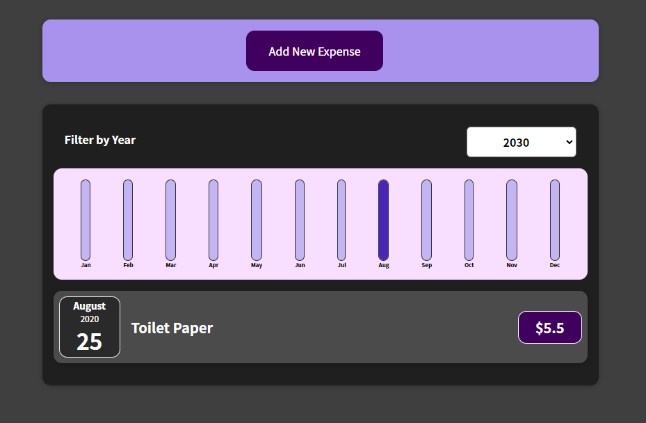

# Getting Started with Create React App

This project was bootstrapped with [Create React App](https://github.com/facebook/create-react-app).

## Available Scripts

In the project directory, you can run:

### `npm install `

Install node dependencies to run an application

### `npm start`

Runs the app in the development mode.\
Open [http://localhost:3000](http://localhost:3000) to view it in your browser.

The page will reload when you make changes.\
You may also see any lint errors in the console.

# Tracker Application 

### `The Button "Add New Expensive" `

When pressed a form will appers to introduce a new expensive to a track

### `A Chart will filter all the expensives according by year `

Pre-seted by 2030 and will show in bottom of chart all the expensives by year!